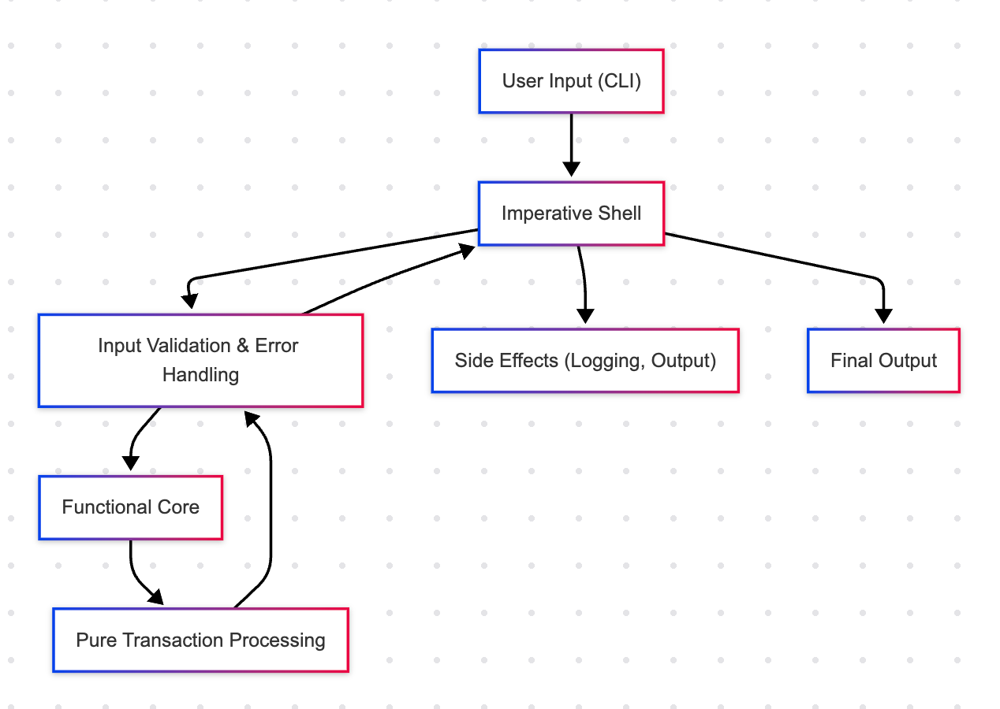

# Functional Core, Imperative Shell: Designing Clean and Maintainable Applications

In modern software development, separating the pure logic from side-effecting operations can greatly enhance maintainability and testability. One effective architectural pattern that embodies this idea is **Functional Core, Imperative Shell**. In this blog post, we explore what this pattern means, its benefits, and how you can implement it in Golang.

### What is "Functional Core, Imperative Shell"?

The **Functional Core, Imperative Shell** pattern advocates for splitting your code into two distinct parts:

- **Functional Core:** This part of the application is composed of pure functions. These functions have no side effects; they take inputs and produce outputs without modifying any external state. This makes them predictable, easier to test, and reusable.
- **Imperative Shell:** This outer layer handles side effects such as I/O operations, network calls, database transactions, and user interactions. It acts as a bridge between the pure functional core and the messy, real world.

By designing your application with a functional core and an imperative shell, you can isolate complexity, improve reliability, and facilitate easier testing of business logic.

### Why Use This Pattern?

- **Testability:** Pure functions in the functional core can be unit tested without requiring complex mocks or stubs for external dependencies.
- **Maintainability:** A clean separation of concerns allows developers to understand and modify the core business logic without worrying about side effects.
- **Modularity:** Changes in the imperative shell (like switching a database or updating I/O logic) don’t require modifications to the core logic.
- **Reusability:** Pure functions can be reused in different contexts or even across projects.


### Architecture Overview



### Go example

```
package main

import (
	"fmt"
	"os"
	"strconv"
)

// Functional Core: Pure function that processes transactions.
func processTransactions(balance float64, transactions []float64) float64 {
	for _, t := range transactions {
		balance += t
	}
	return balance
}

func main() {
	if len(os.Args) < 3 {
		fmt.Println("Usage: go run main.go <initial balance> <transaction1> <transaction2> ...")
		os.Exit(1)
	}

	initialBalance, err := strconv.ParseFloat(os.Args[1], 64)
	if err != nil {
		fmt.Println("Invalid initial balance. Please provide a valid number.")
		os.Exit(1)
	}

	transactions := []float64{}
	for i := 2; i < len(os.Args); i++ {
		transaction, err := strconv.ParseFloat(os.Args[i], 64)
		if err != nil {
			fmt.Printf("Invalid transaction value: %s\n", os.Args[i])
			os.Exit(1)
		}
		transactions = append(transactions, transaction)
	}

	finalBalance := processTransactions(initialBalance, transactions)
	fmt.Printf("Final balance: %.2f\n", finalBalance)
}
```
### Conclusion

As you can see "functional core" are functions. And we IO, logging and error handling to the edges of the application.

- **Functional Core** (`processTransactions` function):
This function is pure; it simply takes the initial balance and a slice of transactions, then iterates over them to compute and return the final balance. There are no side effects—nothing is printed or logged within this function.

- **Imperative Shell** (`main` function):
The `main` function takes care of:
  - **Input Handling:** Reading command-line arguments.
  - **Input Validation:** Ensuring the initial balance and each transaction are valid numbers.
  - **Error Handling:** Printing helpful messages and exiting when an error is encountered.
  - **Logging:** centralized place for logs.
  - **Output:** Displaying the final balance to the user.

By confining side effects (like I/O and error management) to the imperative shell, our core logic remains clean, testable, and reusable.
